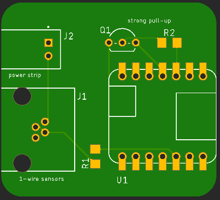
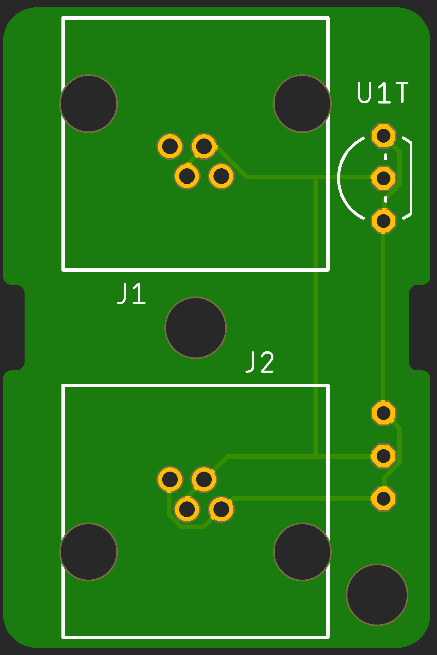

# Heater Control

## Intro

This project uses a microcontroller to read a chain of Dallas Semiconductor DS18B20 1-Wire temperature sensors. When any of the sensors reads too low an electric heater is turned on via a "IOT" Power Strip.

The sensors boards are connected together with cheap phone wire cords with RJ-11 connectors on the ends. The control line to the power strip connects via a JST XH 2-pin connector to the strip's screw terminal block, which is removable for easier connection.

The sensor boards have been used with an Arduino Uno and protoboard shield to prevent plumbing and fixtures in an outbuilding from freezing for a few seasons now. This is the next generation build that uses a custom (but simple) circuit board with a smaller enclosure, simpler wiring, and a display.

## Status

|    Date    | Status                                                       |
| :--------: | ------------------------------------------------------------ |
| 2022-12-23 | Changed out the 4.7kΩ pull-up resistor for a 3.3kΩ one and finished the installation. |
| 2022-12-18 | Adding a hard pull-up for the DQ line as stability problems have been encountered. |
| 2022-12-02 | First check-in. Gerber, enclosure, and software files pending. |

**2022-12-23** I added the p-channel MOSFET for the strong pull-up. That didn't improve anything at all. I finally swapped out the 4.7kΩ pull-up resistor for a 3.3kΩ one since the voltage had changed from 5V to 3.3V. After that the project started working reliably with and without the strong pull-up function. I'll be adding the strong pull-up components to the board design - it will likely help with longer sensor runs.

**2022-12-18** One unit has worked fine, the other will either not recognize connected sensors, or the sensors do not stay on-line. The driver supports a hard pull-up provided by a P-channel MOSFET driven by a second GPIO line.

Moving from a 5V MCU to a 3.3V one has probably exposed a lurking problem if the datasheet is any indication.

## The Boards

### The Controller Board

The controller board hosts:

*  an Adafruit QT Py SAMD21 (#4600) microcontroller
* a Molex RJ-11 jack for connecting to the sensor line
* a JST XH 2-pin connector for controlling the power strip
* a pull-up resistor to pull the DQ 1-wire data line up to 3V3
* an optional 128x32 pixel 4-line I2C OLED display.

### The Sensor Board

Sensor board components:

* A Dallas Semi DS18B20 1-Wire Temperature sensor
* a Molex RJ-11 Jack
* Deprecated components:
  * a JST XH 3-pin for connecting to the old controller (now vacant)
  * a 4.7kΩ pull-up resistor for use with the old controller (now vacant)

## Wiring

When using cheap 4-conductor phone line line you'll find that the the connectors are often crimped such that the pin order is reversed from end-to-end. This is not an issue for phone equipment using the outer and inner concentric pairs. You do have to make sure that it's a 4-conductor cable and not just 2 conductors for the center pair.

The DS18x20 supports parasitic power. The three terminals are:

* Vdd - power
* DQ - data
* GND - ground

With power provided via the pulled-up DQ line, and the Vdd pin grounded, the IC operates on parasitic power. I use both leads of the inner pair for data/power line DQ and the outer pair for ground.

Power is provided via a USB-C cable to the QT Py micro. The small heater is powered from the power strip which also power the USB-C cable via one of the "Always On" outlets.

The OLED display is controlled and powered via the Qwiic/STEMMA QT I2C connector on the QT Py micro.

## The Enclosure

The SCAD and .stl files for a simple enclosure are provided. (still tweaking the design)