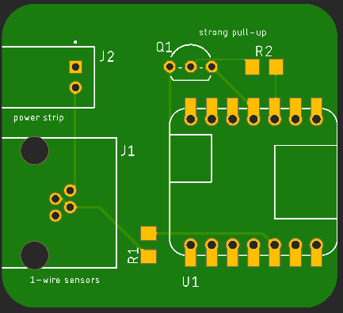

# Heater Controller Board

## Intro

This project uses a microcontroller to read a chain of Dallas Semiconductor DS18x20 1-Wire temperature sensors. When any of the sensors reads too low an electric heater is turned on via a "IOT" Power Strip.

The sensors boards are connected together with cheap phone wire cords with RJ-11 connectors on the ends. The control line to the power strip connects via a JST XH 2-pin connector to the strip's screw terminal block, which is removable for easier connection.

The sensor boards have been used with an Arduino Uno and protoboard shield to prevent plumbing and fixtures in an outbuilding from freezing for a few seasons now. This is the next generation build that uses a custom (but simple) circuit board with a smaller enclosure, simpler wiring, and a display.

## Status

|    Date    | Status                                                       |
| :--------: | ------------------------------------------------------------ |
| 2022-12-18 | Adding a hard pull-up for the DQ line as stability problems have been encountered. |
| 2022-12-02 | First check-in. Gerber and software files pending.           |

One unit has worked fine, the other will either not recognize connected sensors, or the sensors do not stay on-line. The driver supports a hard pull-up provided by a P-channel MOSFET driven by a second GPIO line.

Moving from a 5V MCU to a 3.3V one has probably exposed a lurking problem if the datasheet is any indication.

## Parts List

| Part                |                            Part #                            | Quantity |       Price @q1       | Notes                                      |
| ------------------- | :----------------------------------------------------------: | :------: | :-------------------: | ------------------------------------------ |
| Microcontroller     | Adafruit QT Py SAMD21 (#[4600](https://www.adafruit.com/product/4600)) [D-K](https://www.digikey.com/short/z7fjv1m0) |    1     |         $7.50         | Available on Digi-Key too.                 |
| RJ-11 Jack          |       [43860](https://www.digikey.com/short/1ht3wp4m)        |  1 or 2  |         $1.15         | Combine w/ sensor boards for pricing.      |
| JST XH-2            |  [S2B-XH-A(LF)(SN)](https://www.digikey.com/short/hw1pfpn8)  |    1     |         $0.16         |                                            |
| 4.7kΩ 1206 resistor | Stackpole [RMCF1206JT4K70](https://www.digikey.com/short/4qf3n4vb) |    1     |         $0.01         |                                            |
| OLED display        |                   SSD-1306 128x32 4-lines                    |    1     |           ?           | Amazon or eBay                             |
| Qwiic/SQT cable     |                 4-conductor w/ JST connector                 |    1     |           ?           | Amazon or eBay                             |
| "IOT" Power Strip   |   Adafruit #[2935](https://www.adafruit.com/product/2935)    |    1     |        $34.95         |                                            |
| PCB                 |           Zipped Gerber files for JLCPCB or PCBWay           |    1     | (5) for $2 + shipping | Shipping speed is the biggest cost factor. |

## Component Functions

The  microcontroller reads the sensors and controls the power strip. It also displays information to the optional OLED display and/or LED/Neopixel.

The Molex RJ-11 jack connects to the sensor line via 4-conductor phone cables.

The JST XH 2-pin connector connects to the power strip to turn it on and off.

The pull-up resistor pulls the DQ 1-wire data line up to 3V3.

The optional 128x32 pixel 4-line I2C OLED display show individual and minimum temperatures per read cycle, the lowest long-term temp, heater status, and total heater run-time. Or whatever you care to add to the code.

The Qwiic/STEMMA QT cable provide power and data to the OLED display. Order a short cable and solder one end to the display, and plug the connector end into the QT Py micro.

## Wiring

Power is provided via a USB-C cable to the QT Py micro. The small heater is powered from the power strip which also power the USB-C cable via one of the "Always On" outlets.

The OLED display is controlled and powered via the Qwiic/STEMMA QT I2C connector on the QT Py micro.

When using cheap 4-conductor phone line line you'll find that the the connectors are often crimped such that the pin order is reversed from end-to-end. This is not an issue for phone equipment using the outer and inner concentric pairs. You do have to make sure that it's a 4-conductor cable and not just 2 conductors for the center pair.

The DS18x20 supports parasitic power. The three terminals are:

* Vdd - power
* DQ - data
* GND - ground

With power provided via the pulled-up DQ line, and the Vdd pin grounded, the IC operates on parasitic power. I use both leads of the inner pair for data/power line DQ and the outer pair for ground.

## The Enclosure

The SCAD and .stl files for a simple enclosure are provided. (still tweaking the design)