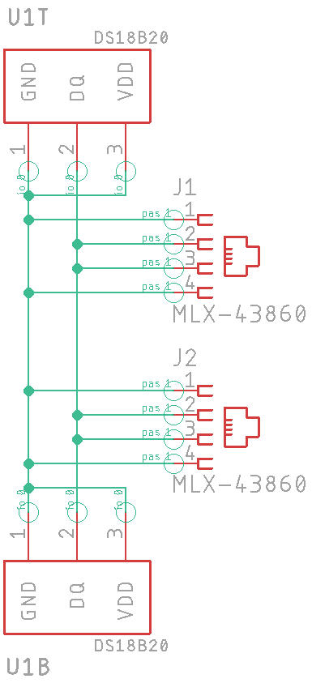

# Heater Sensor Board

## Intro

This project uses a microcontroller to read a chain of Dallas Semiconductor DS18x20 1-Wire temperature sensors. When any of the sensors reads too low an electric heater is turned on via a "IOT" Power Strip.

The sensors boards are connected together with cheap phone wire cords with RJ-11 connectors on the ends. The control line to the power strip connects via a JST XH 2-pin connector to the strip's screw terminal block, which is removable for easier connection.

The sensor boards have been used with an Arduino Uno and protoboard shield to prevent plumbing and fixtures in an outbuilding from freezing for a few seasons now. This is the next generation build that uses a custom (but simple) circuit board with a smaller enclosure, simpler wiring, and a display.

## Status

|    Date    | Status                                           |
| :--------: | ------------------------------------------------ |
| 2022-12-03 | Redesigned Sensor board. Ordered (5) 3x3 panels. |
| 2022-12-02 | First check-in. Gerber files are pending.        |

As fate would have it I need more sensor boards so I revised the sensor part schematic then the board. Obsolete parts were removed. Mounting options were revised.

## Parts List

|        Item        |                         Part #                          | Quantity |                     Price @q10                      | Notes                                      |
| :----------------: | :-----------------------------------------------------: | :------: | :-------------------------------------------------: | ------------------------------------------ |
| Temperature Sensor | [1-Wire Search](https://www.digikey.com/short/5w14dwnw) |    1     |                       $6.413                        | See below.                                 |
|     RJ-11 Jack     |     [43860](https://www.digikey.com/short/1ht3wp4m)     |  1 or 2  |                       $0.949                        |                                            |
|        PCB         |        Zipped Gerber files for JLCPCB or PCBWay         |    5+    | (5) for $2 + shipping (45) for $7.30 + shipping | Shipping speed is the biggest cost factor. |

**Notes on the PCB:**

The new PCB is small enough to be panelized where multiple boards are made on one panel and milled so that they snap apart. The standard minimum order is (5) 100x100mm (or smaller) boards for $2.00 plus shipping. With panelized boards you get (5) panels for a few dollars more. With (9) boards per panel you can easily get (45) individual boards for a reasonable price.

**Notes regarding the temperature sensor:**

The old Dallas Semi DS18x20 1-Wire Temperature sensor has fallen out of favor and is becoming increasingly rare and costly. Items to consider regarding the Digi-Key search results linked to above:

* The MAX31820  sensors are cheaper but the DS18(b)20/20 has better accuracy from +10°C to -10°C.
* These offer 11 or 12-bit precision - I'm only using 10-bits.

You can probably source the DS18B20 sensors cheaper on eBay or [AllElectronics.com](https://www.allelectronics.com/item/ds18b20/digital-temperature-sensor/1.html).

After my stock of DS18B20s runs out I'll probably switch to a cheap I2C-based chip, but that would ruin my scheme of using cheap phone cables without regard to their connector polarity (which was a pain to check on every single cable).

## Wiring

When using cheap 4-conductor phone line line you'll find that the the connectors are often crimped such that the pin order is reversed from end-to-end. This is not an issue for telephone equipment using the outer and inner concentric pairs. You do have to make sure that it's a 4-conductor cable and not just 2 conductors using only the center pair.

The DS18x20 supports parasitic power. The three terminals are:

* Vdd - power
* DQ - data
* GND - ground

With power provided via the pulled-up DQ line, and the Vdd pin grounded, the IC operates on parasitic power. I use both leads of the inner pair for data/power line DQ and the outer pair for ground.

## Mounting Options

The new board offers multiple mounting options:

* There are notches for mounting with a cable tie.
* Two M3 holes are provided at the center and corner.
* A sensor can be soldered on either side (or even both sides if desired).

## Schematic

The schematic shows two locations for the sensor, U1T and B for top and bottom. This gives the option of installing a sensor **on either the top or bottom side** depending on how the board is mounted and the best location for the sensor. You could install two sensors, but that is not the intention.

