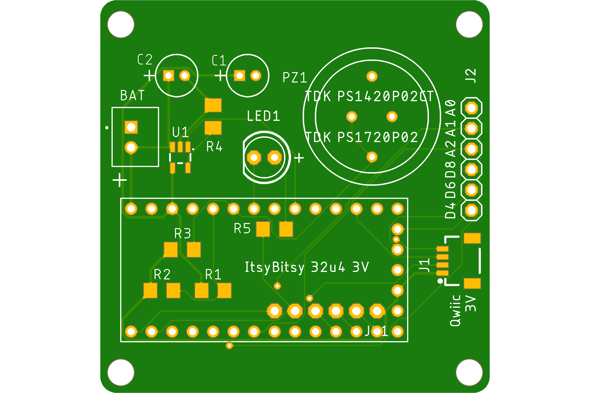
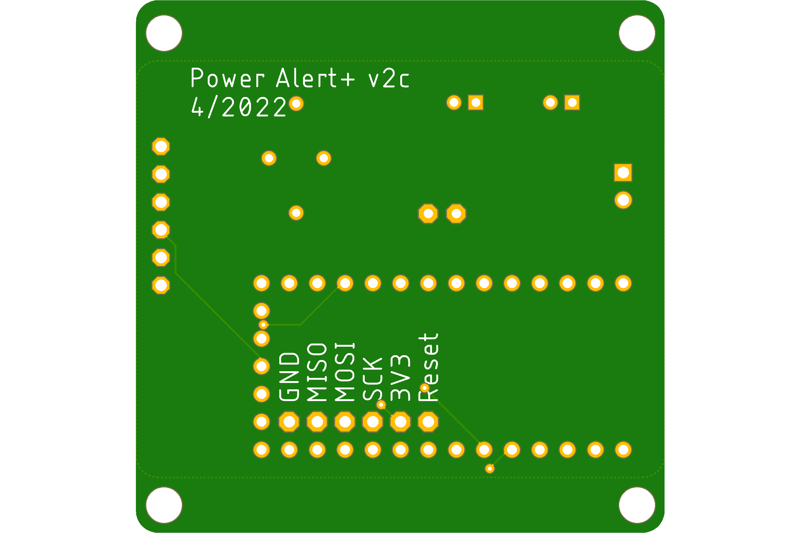

# Power Alert

A board alerts you to a power loss. Maybe more.

### Overview

This board has some general utility given that it has:

+ a big, bright LED
+ a Piezo speaker
+ a battery connector for a lithium battery - Li-ion or Li-po pouch cell
+ a charging IC for the lithium battery (4.2V).

To that end it has been extended for alternate uses. It provides:

* a Qwiic/STEMMA QT I2C connector providing GND, V+, SDA and SCL for connection to sensors, displays, ...
* exposed Itsy Bitsy MCU pins
  * GPIO: A0, A1,  A2, D4, D6, D8
  * SPI: MOSI, MISO, SCLK
  * Power: Vdd, GND

### Board Components

An export of my [Digi-Key](https://www.digikey.com/) project list is located in the hardware folder. Two things to be aware of:

1. Two piezo elements are listed. The [larger](https://www.digikey.com/en/products/detail/tdk-corporation/PS1740P02E/935933) diameter one is shorter and has better specs and is preferred. A [second](https://www.digikey.com/en/products/detail/tdk-corporation/PS1420P02CT/935925) one is listed as an alternate.
2. The current limiting resistor (R5) was selected based on the LED I had on hand (Vf 1.67V) for 20mA current. It's a bit bright - a higher value for less current and power may be desirable.
3. There is no LED in the list because I used what I had in stock (p/n unknown). Pick something similar and pick an appropriate current limiting resistor. All resistors are SMD 1206 size.

#### MCU

An Adafruit ItsyBitsy 32u4 3V 8MHz microcontroller board, product [#3675](https://www.adafruit.com/product/3675). is used given that it will run off of a Li-po cell and is reasonably priced (~$9.95).

##### Pins Used

MCU pins are:

* Power: BAT, USB, 3V3, GND
* Outputs:
  * 11 - Piezo Alert, PWM
  * 10 - LED Alert, active low, low-side switch (switched to ground)
  * 13 - LED_BUILTIN used to indicate that battery charging is in progress
* Inputs:
  * 12 - Voltage divider - ADC sensing of Vin (Vusb or Vbat) / 2
  * 7 - Charge Status, active low when charging
* Other pins exposed as mentioned above.

#### Lithium Cell Charger

The Microchip [MCP73832T](https://www.digikey.com/short/nh2n5n3z) is currently out of stock so please check the product page before proceeding - if you care about battery charging that is.

#### Piezo Element

The piezo speaker supports variable frequencies using a modulated output. Here I use 50% pulse width modulation (PWM) via the tone() function.

#### Discrete Components

* Bypass capacitors C1 & C2 are for the charger IC.
* Resistors R1 & R2 form the voltage divider used for voltage sensing.
* R3 is the recommended value for use with the piezo element.
* R4 sets the charging voltage (or maybe the current) .
* R5 limits the current and provides the appropriate voltage for LED1.
* LED1 is your typical 5mm LED, unspecified otherwise.

### The Battery

I used a flat lithium Li-po pouch cell that fits well behind the board. I have not measured power consumption while the board is alerting, but I suspect the will last well over a day.

The battery is terminated with a JST XH 2-conductor connector. **Please note the polarity of the red and black leads!** There is no standard convention that you can rely on. The polarity is marked on the board such that the red lead is toward the MCU.

The cell should be fitted with a DW-01 type **protection circuit** that prevents overcharging, over-discharging, and over-current conditions. The circuit is usually mounted on top under the Kapton polyamide tape.

### Mounting

The board can be mounted using (4) M3 screws or the flanges on the top an bottom of the board.

### Software

The provided code is just for my application. Feel free to tinker.

The board is expected to be powered with 5V via the micro-USB cable.

#### Board Operation

##### Power-up

On power-up the MCU turns on the beeper and LEDs twice to indicate that the alerting components are functioning.

##### Running Normally

 If the charging IC senses that the battery needs charging the MCU will sense that and turn on the small LED on the microcontroller board.

There will be a very short pulse of the big LED once a second to indicate that the board is functioning and that there have been no power losses.

##### Loss of USB Power

Upon loss of USB power the board will start beeping and flashing. **To turn off the !^$# beeping**, press the RESET button on the MCU.

##### Restoration of Power

When USB power is restored, beeping will stop, but the LED will continue to flash an alerting pattern to indicate an earlier power loss. Press the MCU's reset button to reset this indication.

### Images

  

