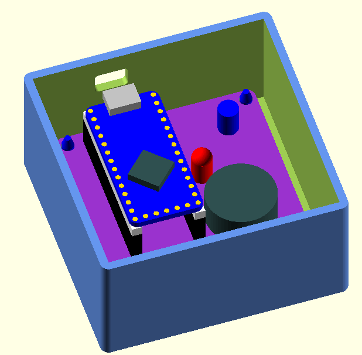

# Power Alert Board Enclosure

This folder contains files to create the base and lid for the Power Alert board enclosure. It was designed with OpenSCAD.

My files may contain Boolean definitions that generate parts to be installed (like boards) in order to visualize the package.

My narrow OpenSCAD file code formatting matches my editor window. Formatting of the code is a product of the OpenSCAD learning process for me. My apologies should it offend you.

## Status

|    Date    | Status               |
| :--------: | -------------------- |
| 2022-10-31 | Preliminary release. |

## Files

| File                     | Description                                                  |
| ------------------------ | ------------------------------------------------------------ |
| base.scad                | OpenSCAD file for the box base.                              |
| lid.scad                 | OpenSCAD file for the box lid.                               |
| common.stl               | Dimensions, functions, and modules common to multiple parts. |
| base.stl                 | File for 3-D printing.                                       |
| lid.stl                  | File for 3-D printing.                                       |
| base_with_components.stl | File for viewing board layout, **not for printing**.         |

